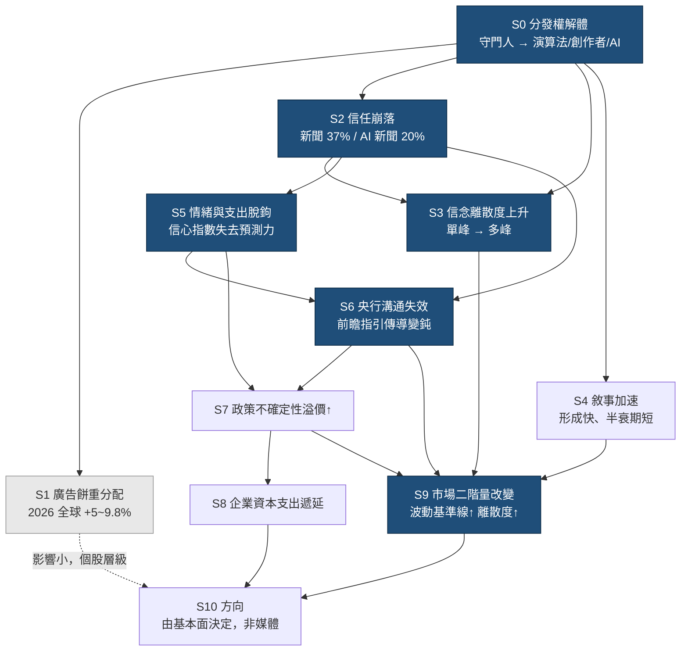
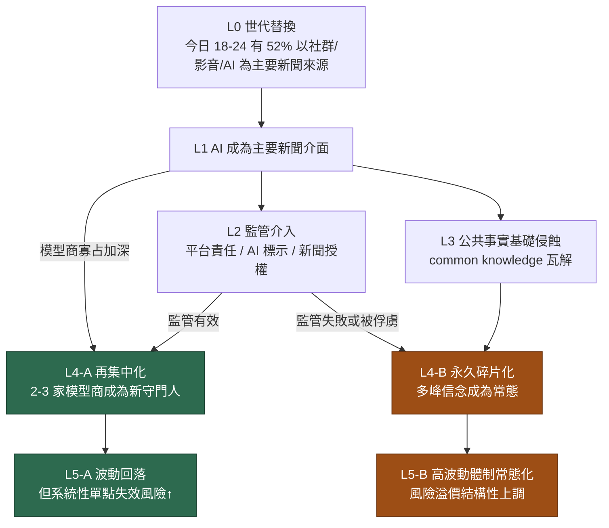

# 沙盤總覽：媒體結構 → 經濟 → 市場

> **這是條件式推理地圖，不是預測模型。**
> 下面的節點與分岔絕大多數**尚未經過實證檢驗**。已檢驗的那一個（S5）**被推翻了**。
> 讀的時候請把每個箭頭當作「如果…那麼…」的假說，不是「會發生」的判斷。
> 每個節點的認識論狀態見第零節的狀態表。

---

## 〇、認識論狀態表 ⭐ 先看這個

| 節點 | 狀態 | 說明 |
|---|---|---|
| [[S0-分發權解體]] | 🟢 **事實** | Reuters DNR 2026：48 國中 30 國社群/影音已超越電視 |
| [[S1-廣告餅重分配]] | 🟢 **事實** | 2026 全球廣告 +5~9.8%，是重分配非縮水 |
| [[S2-信任崩落]] | 🟢 **事實** | 新聞信任 37%（-3pp），AI 新聞信任 20% |
| [[L0-世代替換]] | 🟢 **事實** | 18–24 歲 52% 以社群/影音/AI 為主要來源 |
| [[L1-AI成為主要新聞介面]] | 🟡 **進行中** | chatbot 週使用 7%→10%，方向明確，終點未定 |
| [[S3-信念離散度上升]] | ⬜ **未檢驗** | ⚠️ **這是整條鏈的地基，而它從未被直接測量** |
| [[S4-敘事加速]] | ⬜ **未檢驗** | 可檢驗（動能因子劣化），方法見 V3 |
| [[S6-央行溝通失效]] | ⬜ **未檢驗** | 可部分檢驗（家計 vs 市場通膨預期落差） |
| [[S7-政策不確定性溢價]] | ⬜ **未檢驗** | 可檢驗（EPU 指數趨勢） |
| [[S8-企業資本支出遞延]] | 🔴 **自評最弱** | 隔七層，且 AI 資本支出蓋過一切 |
| [[S9-市場二階量改變]] | ⬜ **未檢驗** | 可檢驗（相關性、離散度趨勢） |
| [[L2-監管介入]] ~ [[L5-長期市場均衡]] | ⬜ **難以檢驗** | 長期結構性，缺乏可證偽的近期預測 |
| [[S5-情緒與支出脫鉤]] | ❌ **已證偽** | V1/V1b/V1c 三檢定，降級為註腳 → [[V1-結果]] |

**實證記錄：1 個節點被檢驗，1 個被推翻。其餘未檢驗。**

⚠️ 特別注意 **S3**。所有下游結論都建立在「信念分布真的從單峰變多峰」這個假設上，
而這個假設**從頭到尾沒有被直接測量過**。它是主樑，不是側枝。
V1 花了一整天測 S5（側枝），而且它斷了。

---

## 一、核心論證（一句話版）

傳統媒體 = **慢速、集中、有守門人**的資訊管道，它生產的是「延遲但同質」的信念。
取代它的演算法／創作者／AI 分發 = **快速、分散、依偏好分岔**。
於是市場參與者的信念分布從**單峰變多峰**，而且**切換速度快很多**。
→ 這改變的是**波動、離散度、輪動速度、情緒與基本面的耦合強度**，不是方向。

---

## 二、短期沙盤（1–3 年，可驗證）

**注意 S1 是刻意畫成虛線的。** 廣告市場 2026 仍在成長（dentsu 估 +5%，樂觀機構估 +9.5~9.8%，加上冬奧、世界盃、選舉年）。「傳統媒體崩＝經濟差」是錯誤推論——餅在變大，只是換人吃。這條線對總體 GDP 影響很小，主要是**個股層級的贏家輸家**，不是宏觀變數。真正的傳導在 S2→S3→S9 那條。

---

## 三、長期沙盤（5–10 年，結構性）

**長期最關鍵的分岔在 L4。** 這是一個真正的雙穩態：
- **L4-A 再集中化** → 共識重新單峰化 → 波動回落，但錯誤變成**系統性**（所有人被同一個模型餵同一個錯誤敘事，沒有異議者當煞車）。這比高波動更危險，只是危險以不同形式出現。
- **L4-B 永久碎片化** → 高波動、高離散度成為新常態，市場學會定價它，風險溢價結構性上調一級。

---

## 四、兩層如何耦合

短期節點掛在長期趨勢底下，不是平行的兩件事：

| 短期節點 | 掛在哪個長期節點底下 | 耦合方式 |
|---|---|---|
| S3 信念離散度 | L4 集中 vs 碎片 | S3 是 L4-B 的早期讀數；若 S3 在 3 年內回落，L4-A 機率上調 |
| S5 情緒脫鉤 | L3 公共事實基礎 | S5 是 L3 最早可量化的症狀 |
| S6 央行溝通失效 | L3 + L4 | 若走 L4-A，央行只需說服少數模型商，S6 可能反轉 |
| S9 波動結構 | L5 | S9 是 L5 的短期投影 |

**這裡有個反直覺的推論值得記住：** 走 L4-A（AI 再集中化）的話，**央行溝通效力可能反而回升**——因為「說服全社會」變成「讓 2–3 個模型正確摘要你的聲明」。這是一個技術性、可執行的問題，比說服一億個分裂的社群使用者容易得多。S6 的長期方向因此高度依賴 L4 怎麼倒。

---

## 五、節點索引

### 短期（1–3 年）
- [[S0-分發權解體]] — 驅動源
- [[S1-廣告餅重分配]] — 產業層，宏觀影響小
- [[S2-信任崩落]] — **關鍵節點**
- [[S3-信念離散度上升]] — **關鍵節點**
- [[S4-敘事加速]]
- [[S5-情緒與支出脫鉤]] — ⛔ **已降級為註腳（2026-08-13 證偽）** → [[V1-結果]]
- [[S6-央行溝通失效]]
- [[S7-政策不確定性溢價]]
- [[S8-企業資本支出遞延]]
- [[S9-市場二階量改變]] — **結論節點**

### 長期（5–10 年）
- [[L0-世代替換]]
- [[L1-AI成為主要新聞介面]]
- [[L2-監管介入]]
- [[L3-公共事實基礎侵蝕]]
- [[L4-集中化vs碎片化]] — **長期主分岔**
- [[L5-長期市場均衡]]

### 情境劇本
- [[S-A-制度重建]]
- [[S-B-緩慢侵蝕（基準）]]
- [[S-C-敘事失控]]

### 工具
- [[V1-結果]] — **已完成的驗證，含 S5 的證偽與降級**
- `V1c-滾動趨勢圖.html` — 47 年滾動視窗圖（用瀏覽器開）
- [[追蹤指標清單]]
- [[2026證據基礎]]

---

## 六、這張圖不能做什麼（原始版，2026-08-13 上午寫）

誠實界定範圍，避免自我欺騙：

1. **不能預測方向。** 媒體結構影響的是分布的形狀（變異數、峰態），不是均值。任何從這張圖推出「所以要買/賣」的結論都是過度延伸。
2. **因果識別很弱。** S5（情緒脫鉤）同時可以用通膨記憶、住房負擔、政治極化解釋，媒體只是候選解釋之一。要分離出媒體的貢獻需要真正的識別策略，目前沒有。
3. **時間尺度不確定。** 就算方向對，S6、S8 這類節點可能要 5 年才顯現，不是 2 年。市場可以在你正確之前先讓你破產。
4. **反身性。** 一旦這個框架變成共識，它就會被定價，然後失效。

---

## 七、2026-08-13 重新定位

V1 證偽 S5 之後，本 vault 從**預測框架**改為**條件式推理工具**。決策紀錄見
[[2026-08-13-沙盤重新定位]]。

第六節原本寫了四條「這張圖不能做什麼」，現在要加第五條，而且它比前四條都重要：

> **5. 這張圖的絕大多數主張沒有被檢驗過，而唯一被檢驗過的那個是錯的。**

保留這張圖的理由不是它對，是它**有用**：

- 事件發生時可以快速定位影響路徑
- 每個主張都標了認識論狀態，不會把假設當事實
- 被排除的選項與理由都留著，未來重看時知道當初在想什麼

推演過程中確實產出了幾個我認為有獨立價值的觀察，它們不依賴整條因果鏈成立：

1. **[[L4-集中化vs碎片化]] 是雙穩態**，兩個結局需要相反的部位結構，無法兩邊押注
2. **若走 L4-A，央行溝通效力可能反而回升**——說服 2–3 個模型比說服一億個使用者容易
3. **情境 C 的引信是官方統計機構的公信力**——在很前面、可觀察、追蹤成本極低

這三個是觀察，不是預測。它們的價值在於指出該盯什麼，不在於說會發生什麼。
