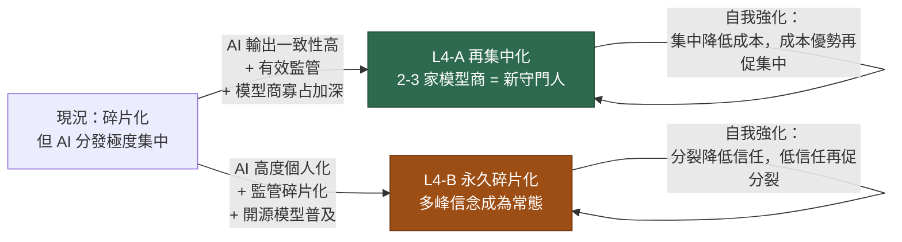

# L4 集中化 vs 碎片化 ⭐⭐⭐（長期主分岔）

上游：[[L1-AI成為主要新聞介面]] [[L2-監管介入]] [[L3-公共事實基礎侵蝕]] ｜ 下游：[[L5-長期市場均衡]]

> **整張長期沙盤收斂到這一個問題。** 其他所有長期節點都只是決定這個分岔往哪倒的輸入。

## 狀態

這是一個**真正的雙穩態系統**——兩個結局都是自我強化的，中間狀態不穩定。

## 兩個分岔的完整描述

### L4-A 再集中化（約 45%）

AI 介面成為主要新聞層，而且輸出高度一致——同一個問題，不同使用者得到大致相同的答案。結果是**比傳統媒體時代更集中的守門機制**：以前有數十家報社電視台，現在有 2–3 個模型。

- 共識重新單峰化 → [[S3-信念離散度上升]] 反轉
- [[S6-央行溝通失效]] 反轉（說服模型比說服群眾容易）
- 波動回落 → L5-A

**但風險換了形式，沒有消失：**
- 錯誤變成**系統性**的。所有人被同一個模型餵同一個錯誤敘事，沒有異議者當煞車。
- 單點失效：一個模型的偏誤、一次成功的攻擊、一個訓練資料汙染，影響全體。
- 治理問題：這 2–3 家公司對「什麼是真的」握有前所未有的權力，且不受選舉問責。

### L4-B 永久碎片化（約 55%）

AI 高度個人化，加上開源模型普及，每個社群有自己的模型與自己的世界描述。

- [[S3-信念離散度上升]] 持續上升並穩定在高檔
- 高波動、高離散度成為新常態 → L5-B
- 市場最終**學會定價它**，風險溢價結構性上調一級

**風險是分散的但總量更高：** 沒有單點失效，但持續的高摩擦、高交易成本、更頻繁的中型危機。

## 決定分岔的關鍵變數（按重要性）

1. **AI 輸出的個人化程度**（最重要）— 可實測：同一問題、不同帳號脈絡，比較輸出變異度
2. **開源模型的能力差距**— 若前沿模型與開源模型差距持續拉大 → 集中；若收斂 → 碎片
3. **監管形態**— 見 [[L2-監管介入]]，注意分岔 C（監管俘虜）表面推向集中但治理最差
4. **模型商的商業模式**— 訂閱制傾向一致性；廣告制傾向個人化（因為個人化＝更好的定向）。**這一條可能被低估：如果 AI 介面走向廣告變現，L4-B 幾乎確定。**

## 觸發訊號

- 前沿模型 vs 開源模型的能力差距（benchmark 落差趨勢）
- AI 介面的市佔集中度（HHI）
- **模型商是否導入廣告**（分岔的最強單一訊號）
- 同問題跨帳號輸出變異度的實測（目前無人系統性追蹤，值得自建）

## 下游影響

直接決定 [[L5-長期市場均衡]] 走 A 或 B。

**對資產配置的含意完全相反：**
| | L4-A → L5-A | L4-B → L5-B |
|---|---|---|
| 波動 | 低 | 高 |
| 尾部 | 罕見但極端 | 頻繁但中等 |
| 該買的保險 | 深度價外、長天期 | 近價、滾動 |
| 主動選股 alpha | 縮小 | 擴大 |
| 風險溢價 | 低（可能過低）| 結構性高 |

**所以這不是一個可以「兩邊押注」的分岔。** 兩種環境需要的部位結構是相反的。這也是為什麼追蹤上面那四個變數比做任何長期預測更有價值。
